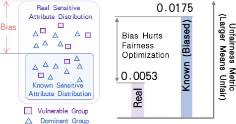

# Fair Recommendation with Biased Limited Sensitive Attribute


# Folder & File structure 
- `./datasets` : Here are the processed **ML-1M** and **LastFM-360K** datasets.
- `./pretrained_model` : Here are the pretrained **ML-1M** and **LastFM-360K** MF models. (No fair regularization)
- `./scripts` : Here are the training scripts.
- `./collaborative_models.py`: NCF model.
- `./MF_DP_fairness.py`: For MF pretraining.
- `./predict_sst_diff_seed.py` : Reconstruction of sensitive attributes using multiple priors.
- `./mpr.py` : Use MPR for fairness training.
- `./fairness_training.py, evaluation.py`: Training utilities.


# Dataset
You can download the original dataset from the following links:
[ml-1m](https://grouplens.org/datasets/movielens/1m/)
[Lastfm-360K](http://ocelma.net/MusicRecommendationDataset/lastfm-360K.html), we also provide the processed dataset in the folder ./datasets/

## 1. Pretrain MF model

on **ml-1m** 
```bash
bash ./scripts/pretrain/pretrain_ml_1m_diff_seed.sh
```
on **Lastfm-360K**
```bash
bash ./scripts/pretrain/pretrain_Lastfm_360K_diff_seed.sh
```
We also provide the pretrained **checkpoints** in the folder ./pretrained_model, you can also train your own and put it in the folder.


## 2. Create Multiple priority
We first establish a predefined set of prior distributions $\mathcal{P}$, which in our setting is $\{ 1/10.0, 1/9.5, 1/9.0, \cdots, 1/1.5, 1, 1.5, 2, \cdots, 9.5, 10 \}$.
We then estimate the distribution of users’ sensitive attributes under each prior distribution $\hat{p}_0 \in \mathcal{P}$ by resampling the known sensitive
attributes. 

on **ml-1m**  
```bash
bash ./scripts/predict_sst_seed_batch/run_ml_1m.sh
```
on **Lastfm-360K**
```bash 
bash ./scripts/predict_sst_seed_batch/run_Lastfm_360K.sh
```


## 3. Multiple Priority Robust Optimization 

We have a hyper-parameter $\beta$ in our optimization objective.
In general, as $\beta$ decreases, the fairness metrics improve.

on **ml-1m**  
```bash
bash ./scripts/MPR_batch/run_ml_1m_safe_thresh_eval_random_init.sh
```
on **Lastfm-360K**
```bash 
bash ./scripts/MPR_batch/run_lastfm_safe_thresh_eval_random_init.sh
```
